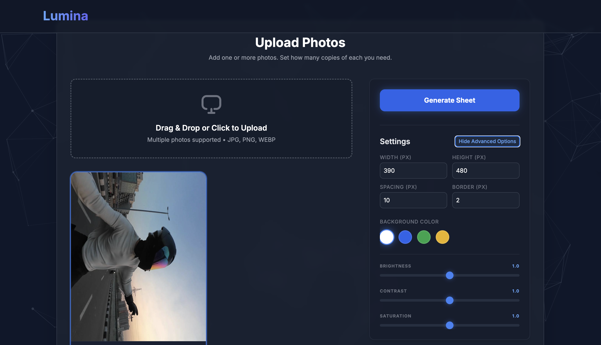

<div align="center">

# 📸 Lumina (Local Edition)

> ⚡ Generate **print-ready passport photo sheets locally** with AI-powered background removal — no APIs, no uploads, 100% private.


</div>

---

## 📸 Demo

<p align="center">
  
</p>

---

## ⚡ Highlights

- 🔒 **100% Local Processing** — No cloud APIs, no data leakage  
- 🤖 **AI Background Removal** using `rembg` (U2NetP)  
- 🎨 **Per-Photo Adjustments** — brightness, contrast, saturation  
- ✂️ **In-browser cropping** with real-time preview  
- 🧠 **Smart sharpening** for professional-quality output  
- 📄 **A4 sheet generation** ready for printing  

---

## 📌 Overview

**Lumina (Local Edition)** is a privacy-first desktop web tool that generates **print-ready passport photo sheets** entirely on your local machine.

Unlike traditional tools that rely on external APIs or paid services, this application performs **AI-based background removal and image processing locally**, ensuring complete privacy and zero dependency on third-party services.

---

## 🧠 How It Works

```text
Upload Image → Crop & Adjust → Local AI Background Removal → Enhancement → Sheet Generation → Download
```

---

## 🚀 Deployment

Lumina is designed for local use, but can be easily deployed to a home server, VPS, or cloud platform.

### ✅ Option 1: Docker (Recommended)
This is the easiest way to deploy without worrying about Python environments or AI model paths.

```bash
# Clone the repository
git clone https://github.com/SUPAM07/Lumina.git
cd Lumina

# Build and start the container
docker-compose up -d --build
```
Access the app at `http://localhost:5001`.

### ⚙️ Option 2: Manual (Virtual Environment)
For users who prefer running directly on their machine:

1. **Install Dependencies**:
   ```bash
   pip install -r requirements.txt
   ```
2. **Launch with Production Server**:
   ```bash
   # Waitress is included and will run automatically
   python3 app.py
   ```

### ☁️ Option 3: Cloud Hosting (Render/Railway)
1. Link your GitHub repository.
2. Use the following build command: `pip install -r requirements.txt`.
3. Set the start command to: `python3 app.py`.
4. Expose port `5001`.

---

## 📄 License
This project is licensed under the MIT License - see the [LICENSE](LICENSE) file for details.

| Layer      | Technology                          |
|------------|-------------------------------------|
| Frontend   | HTML5, Tailwind CSS, Particles.js   |
| Image Prep | Cropper.js (Local CSS Filters)      |
| Backend    | Python, Flask                       |
| Image AI   | `rembg` (U2NetP Lightweight)        |
| Processing | Pillow (PIL)                        |
| Server     | Gunicorn (Production Ready)         |

---

## 🛠️ Installation & Setup

### 1. Prerequisites
- Python 3.8+
- [Optional] Silicon Mac (M1/M2/M3) or any modern CPU.

### 2. Clone & Install
```bash
git clone https://github.com/your-username/passport-photo-pro.git
cd passport-photo-pro

# Create and activate virtual environment
python3 -m venv venv
source venv/bin/activate

# On Windows
venv\Scripts\activate
```

### 3. Install dependencies

```bash
pip install -r requirements.txt
```

### 3. Run the App
```bash
# Activate the environment and run
source venv/bin/activate
python app.py

# Or run directly via venv python:
./venv/bin/python app.py
```

The server will start at `http://localhost:5001`.

---

## 📁 Project Structure

```
passport-photo-pro/
├── app.py                  # Flask backend — image processing & PDF generation
├── requirements.txt        # Python dependencies
├── .env                    # Environment variables (not committed)
├── templates/
│   └── index.html          # Frontend UI
└── README.md
```

---

## 📋 requirements.txt

Make sure your `requirements.txt` includes:

```
flask
pillow
rembg
```

Generate it automatically with:

```bash
pip freeze > requirements.txt
```

---

## 🖼️ How to Use

1. **Upload**: Drag and drop your photos. They will appear in a responsive grid.
2. **Select**: Click on any photo to "select" it (indicated by a blue border).
3. **Crop**: Use the **Crop** button on the selected card to frame your shot.
4. **Enhance**: Use the **Advanced Options** in the sidebar to adjust brightness/contrast for the *selected* photo.
5. **Background**: Choose your layout background (White/Blue/Green/Yellow) for the final sheet.
6. **Generate**: Click **Generate Sheet**. All enhancements and background removal are processed locally.
7. **Download**: Preview and download your A4 passport sheet!

---

## 🔒 Privacy & Performance

- **Privacy**: This application does not use any cloud-based image processing. All ML inference happens on your local machine.
- **Performance**: The first time you use it, `rembg` will download a small (~4MB) model file. Subsequent runs are near-instant.

---

## 📄 License
MIT License. Free to use, modify, and distribute.
